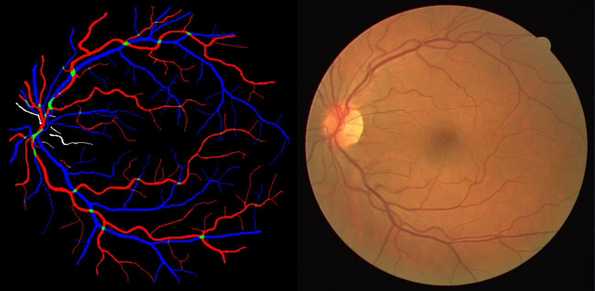
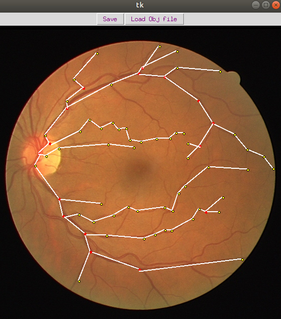

# Arterial Venous Classification Using Graph Convolutional Networks
This project works towards classifying nodes of a network of blood vessels inside a
retina. This problem can be seen as a graph based semi-supervised learning task, where
graphs are generated from vascular images. To encode the diagram structure the system
utilizes a neural network model that trains on a subset of targets for all nodes.

## Setup
The graph network was constructed from the [RITE](https://medicine.uiowa.edu/eye/rite-dataset) dataset containing retinal
fundus images. RITE contains 40 sets of images, equally separated into a training subset
and a test subset. The vessels are manually labelled by experts. Arteries are labelled in
red, veins are labelled in blue, the overlapping of arteries and veins are labelled in green,
the vessels which are uncertain are labelled in white as shown below.



## Tool to generate labelled graphs
The graphs required to be fed as input to the GCN were generated using a tool that allowed hand drawing a graph on top of the fundus images. The tool was used
to gather the ground truth node labels for the graph network. GUI was developed using
[Tkinter](https://g.co/kgs/TYAjKF).

To access the GUI from the program files run the following commands after cloning the repo
```
$ cd GUI
$ python motion_hover.py
```
You should see something like this



This will generate the ground truth labels and the edge information which can be used
as input. To run the model and perform node classification run the following
```
$ cd ..
$ python mainRetina.py
```
## Model
Input fed to the GCN is
* an input feature matrix N x F feature matrix, X, where N is the number of nodes and F
is the number of input features for each node,
* an N x N matrix representation of the graph structure, the adjacency matrix A of the
graph.

For this problem two layers of GCN were chosen considering the size of the input
graphs. The structure of the graph was inputted with a symmetric adjacency matrix A.
Then A^ is calculated before processing the graph. Two types of weight matrices are used,
W(0) from the input layer to a hidden layer and W(1) for hidden layer to output layer.
Then softmax is performed row-wise. For semi-supervised classication, we then evaluate
the cross-entropy error over all labeled examples. The neural network weights W(1) and
W(0) are trained using gradient descent.

Approximation on nodes is achieved by following these steps:
* Perform forward propagation through the GCN.
* Apply the sigmoid function row-wise on the last layer in the GCN.
* Compute the cross entropy loss on known node labels.
* Backpropagate the loss and update the weight matrices W in each layer.

## Results
Results were achieved with the following parameters: 2 hidden
layers (64,32), ReLU as activation, learning rate=0.001 and trained over 800 epochs to get
the following results.

|   Training nodes %   |   Test Accuracy %   |
|----------------      |---------------:|
|5               |68.92           |
|10              |76.78           |
|15              |86.12           |
|20              |85.90           |
|25              |87.14           |
|40              |91.96           |

## Future Work
Future work may include incorporating a separate model for acquiring pre-trained
weights that are to be fed to the graph convolutional network. A suggested approach is to
localize nodes from patches of fundus images and training a model to learn features for the
respective nodes. The richer topological information and weights will also improve the accuracy by a significant
amount.
